# Wireshark HTTP Packet Analysis

Name: Tara Mohammadi

Student ID: 40217023164

---

# Phase 1 – Environment Setup and Packet Capture

In this phase, Wireshark was used to capture network traffic generated by an HTTP request.

First, Wireshark was opened and the active network interface (Wi‑Fi / Ethernet) was selected. Packet capturing was then started.

After starting the capture, an HTTP request was generated using the following curl command in the terminal:

curl http://example.com

curl -I http://example.com

This command sends an HTTP GET request to the web server. After receiving the response in the terminal, the capture process in Wireshark was stopped.

The captured traffic was saved as a `.pcapng` file.

### curl Command in Terminal
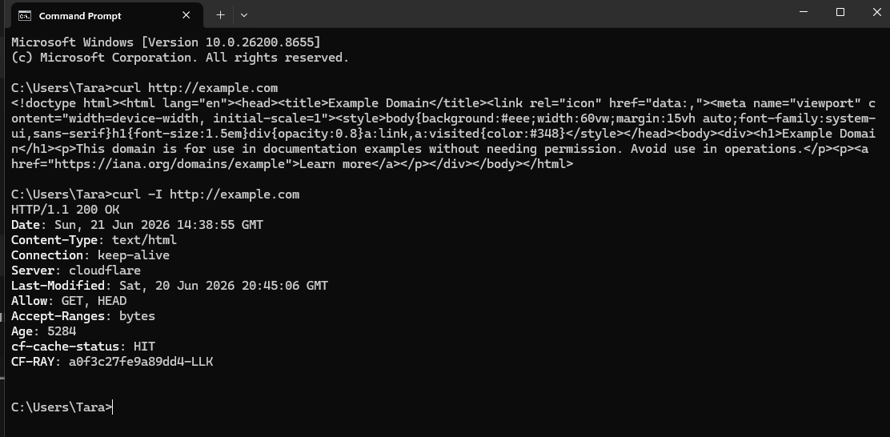

### Captured Packets in Wireshark
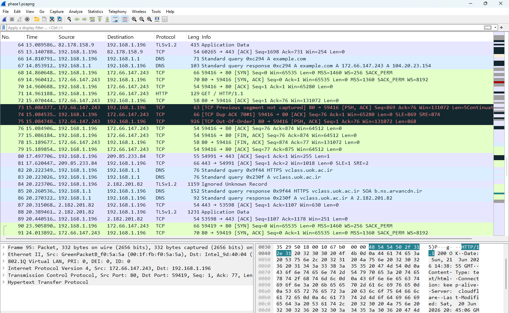

---

# Phase 2 – Protocol Stack and Header Analysis

In this phase, the captured packets were filtered to locate the HTTP traffic generated by the curl request.

The following filter was applied in Wireshark:
http

After applying the filter, the first HTTP GET request generated by curl was identified.

### Application Layer (HTTP)

Host:

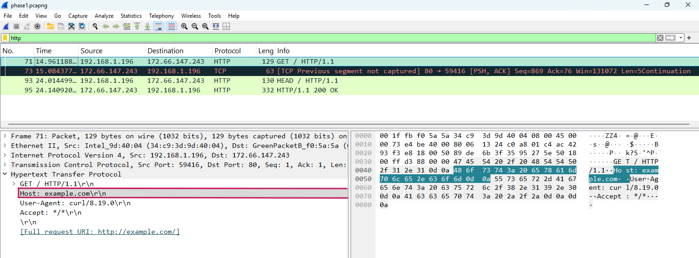

HTTP Version: 

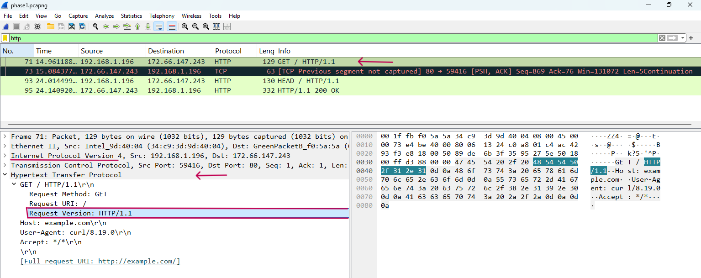

User-Agent: 

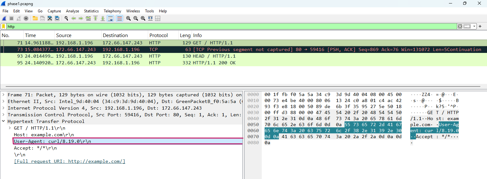

### Transport Layer (TCP)

Protocol: TCP

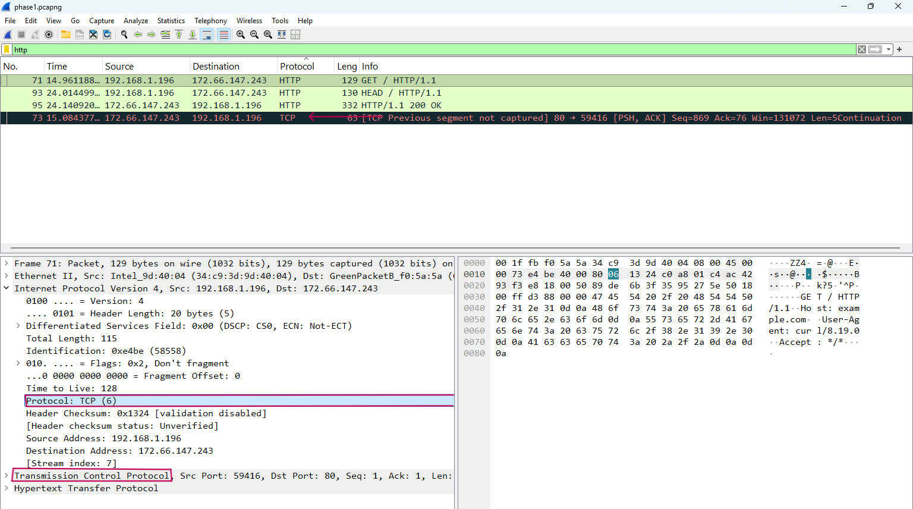

Source Port: 

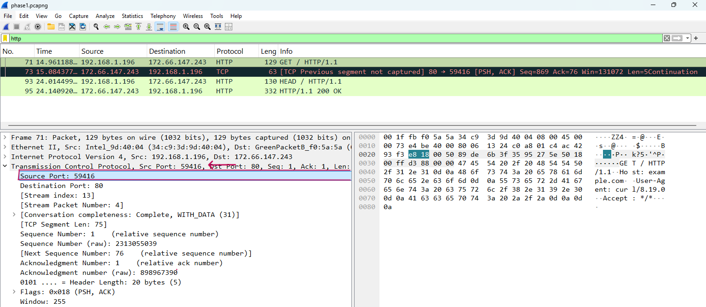

Destination Port: 80  (cause it's HTTP)

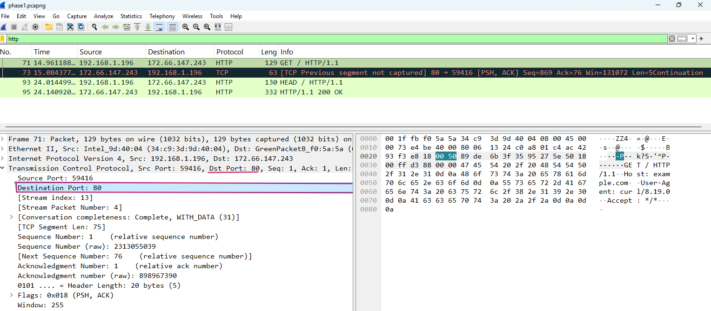

### Network Layer (IP)

Source IP: 

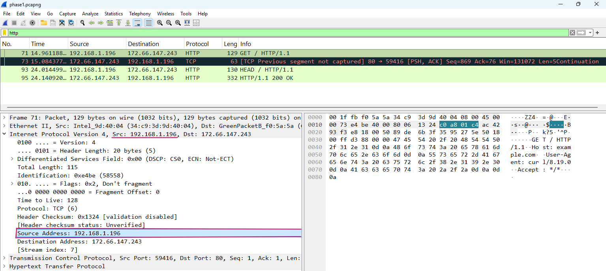

Destination IP:

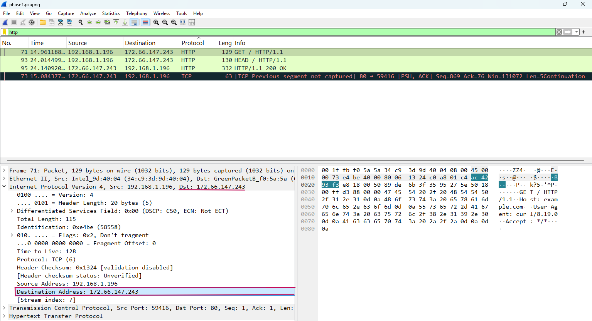

---

# Phase 3 – Server Response and RTT Analysis

In this phase, the HTTP response sent by the server was analyzed.

The response packet corresponding to the HTTP GET request was located in Wireshark.

### HTTP Status Code

Status Code: 200 OK

Meaning:  
The request was successfully processed by the server and the requested resource was returned correctly.

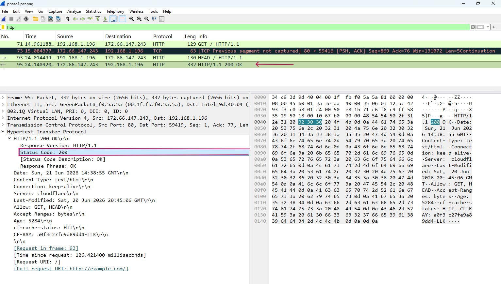

### RTT (Round Trip Time)

The RTT was measured using the **Time Delta** field in Wireshark, which represents the time difference between the HTTP request and the response.

RTT Value: 

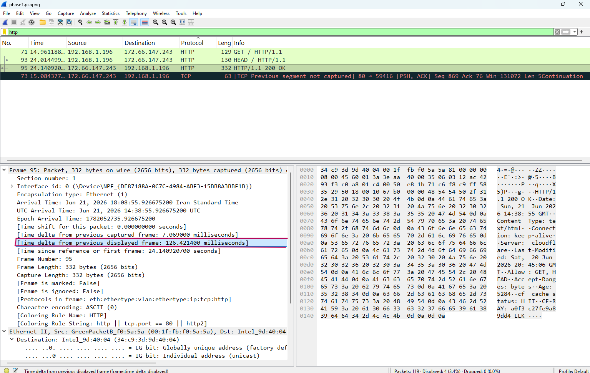

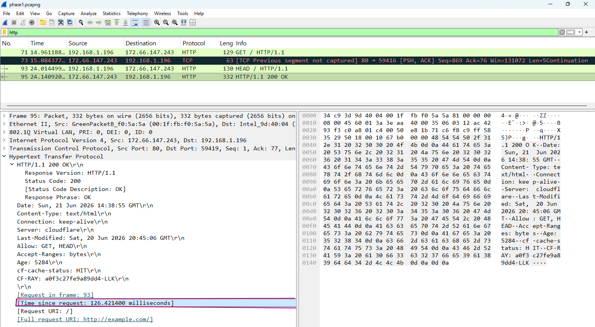

---

# Performance Analysis

---

# Attachments

The captured packet file is available in the following directory:

captures/traffic.pcapng
